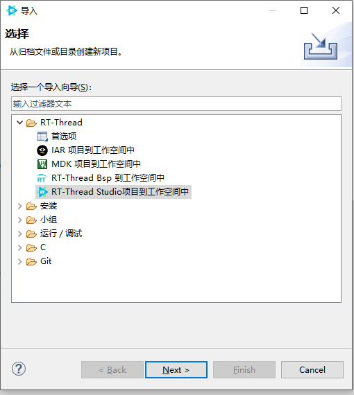

# PSoC6 USB Device CDC 虚拟串口例程

本仓库为英飞凌 PSoC6 使用 USB Device 作为虚拟串口（CDC 设备）的示例，基于 RT-Thread Studio 开发。

## USB 外设与描述符配置

USB 外设及描述符部分使用英飞凌 ModusToolbox 进行配置，主要流程如下：

1. **时钟配置**
   - 使用 ModusToolbox 修改时钟配置，USB 选择 USBFS。
   - 由于 USBFS 要求时钟为 48MHz，需要将 PLL 设置为 96MHz。
   - 时钟树如下图所示：
   
   

2. **USB 设备配置**
   - 配置 USB 设备，选择自动 DMA。
   - 参考英飞凌官方手册：[USBFS Device API Reference Manual](https://infineon.github.io/usbdev/usbfs_dev_api_reference_manual/html/index.html)
   - 保存并移植以下文件到 BSP 中：
     - cycfg_peripherals.c / cycfg_peripherals.h
     - cycfg_system.c / cycfg_system.h
     - cycfg_usbdev.c / cycfg_usbdev.h
     - cycfg_dma.c / cycfg_dma.h
     - cycfg_clock.c / cycfg_clock.h
     
3. **驱动适配**
   - 在 `libraries/HAL_Drivers/` 文件夹中添加并适配 `drv_usbd.c`。

## 目录结构

- `Project/`：工程主目录
  - `applications/`：应用层代码（如 main.c、arduino、lvgl 等）
  - `board/`：板级支持包（BSP）及端口适配
  - `libraries/`：驱动库和硬件抽象层（如 HAL_Drivers、IFX_PSOC6_HAL）
  - `build/`、`Debug/`：编译生成的中间文件和目标文件
  - `rt-thread/`：RT-Thread 内核源码及组件
  - `packages/`：第三方软件包
  - `figures/`：项目相关图片
- `pictures/`：其他图片资源
- `README.md`：项目说明文档

## 参考
- 英飞凌官方手册：[USBFS Device API Reference Manual](https://infineon.github.io/usbdev/usbfs_dev_api_reference_manual/html/index.html)

---

如有问题请提交 issue 或联系维护者。
